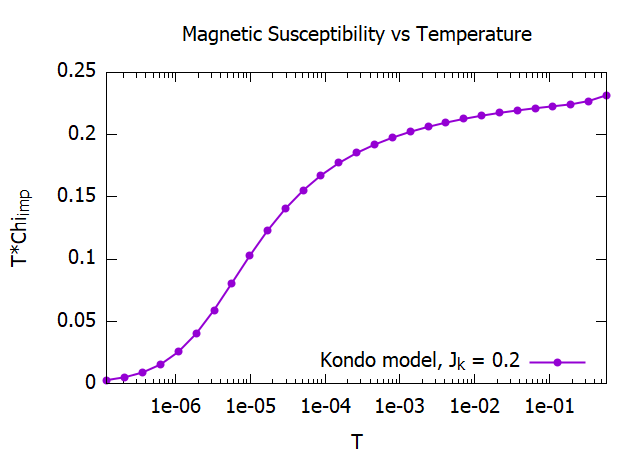
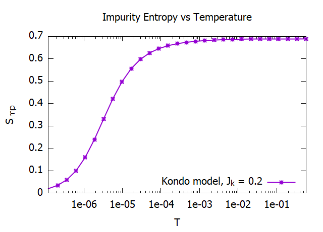
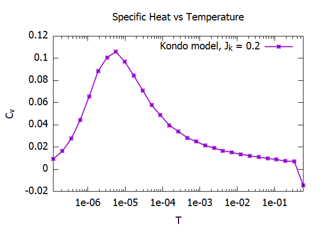
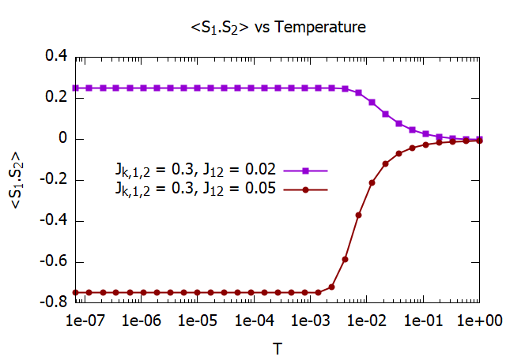

# Numerical-Renormalization-Group

## Introduction

The Numerical Renormalization Group (NRG) Technique is a non-perturbative numerical method that was primarily developed to solve the Kondo problem. The Kondo problem deals with a situation that arises in metals due to the interaction of the conduction electrons with spin 1/2 magnetic impurities (arising from unpaired electrons in the d or f orbitals). Any perturbative treatment of this problem exhibits logarithmic divergences at characteristic temperatures. The NRG was able to solve this problem to low temperatures and capture the formation of the singlet ground state. Since then, the NRG has been used in a range of applications including magnetic hosts in metallic, semi-metallic and superconducting hosts, quantum dots, heavy fermion systems and quantum phase transitions. 

For references see
* [Kondo effect](http://www.scholarpedia.org/article/Kondo_effect) (Scholarpedia)
* [Reviews of Modern Physics](https://doi.org/10.1103/RevModPhys.80.395) paper by Bulla et. al.
* [The Kondo Problem to Heavy Fermions](https://doi.org/10.1017/CBO9780511470752) by A. C. Hewson.
* [Computational Physics Blog](https://compphys.go.ro/the-numerical-renormalization-group/) by Adrian Roman.

## Method
The NRG consists of the following key steps:
* Partition of the conduction band into logarithmic bins.
* Mapping the conduction band into a semi-infinite tight binding fermionic chain with nearest neighbor hopping, known as the Wilson chain (WC). The impurity is attached to one end of the WC.
* The hopping coeffecients drop off exponentially, ensuring convergence of the ground state(s).
* Iterative diagonalization of the WC, where an additional site of the WC is added in each iteration. The basis states of the current iteration are formed using the eigenstates of the previous iteration and the basis states of the additional site of the WC.

## About the code
This is a relatively simple code in MATLAB that implements the NRG for a flat band (constant density of states). The z-component of the total spin (S_z) and the total charge (Q) can be treated as good quantum numbers. This can be used to block-diagonalize the Hamiltonian matrix for computational efficiency.
The main function that runs the code is NRG(). **For details on code usage, input parameters, and other features, please see the file 'Readme.txt'.**
The code can be used to treat three models:
* The spin 1/2 Kondo model wiht 1 impurity,
* The Anderson Impurity model with 1 impurity,
* Two-impurity Kondo model with inter-impurity coupling.
* The code can be easily extended to treat other complex spin-impurity systems.

Sample output files for each of the above cases can be found in the corresponding directory under 'Sample_Outputs/'

## Output
The output file out.dat prints the renormalized eigen-energies for each iteration along with the corresponding quantum numers. The spectrum is shifted such that the ground energy is zero. The following graphs plots the RG flows of the renormalized energy levels for even and odd iterations for the Kondo model with coupling J_k = 0.2

NRG can also be used to calculate the impurity contribution to themodynamic quantities such as the magnetic susceptibility, entropy and specific heat. The following graphs plots these quantities as a function of temperature for the Kondo model for Kondo coupling Jk = 0.2. 

Additionally, one can slo compute expectation values of impurity operators. As an example, the following graph plots the expectation value of the operator <S1.S2> for the two-impurity Kondo model as a function of temperature T. Plots are shown for two values of J12, keeping the Kondo couplings J_k fixed at J_k = 0.3.

Note: I have used units where the bandwidth D = k_B = hbar = 1.

## Updates
The code can be further expanded to include non-uniform density of states, and to deal with multi-channel cases. Further one case also use the Clebsch Gordan coefficients to use total S and the corresponding axial charge operators to further reduce the effective size of the matrices that needs to be diagonalized. The codes will be updated when these changes are implemented.

